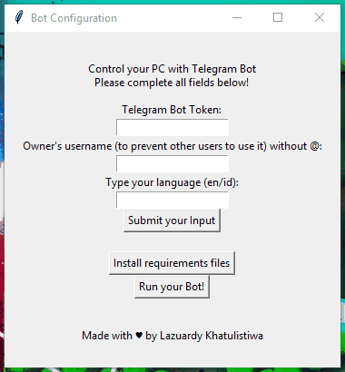

# Remote-PC-Telegram
Control your PC with Telegram Bot.
You can browse any url, play youtube video, shutdown, reboot, and check your PC status.

## Getting Started
### Prerequisites

Required:

- Python 3.5+ (for Windows user you must add Python to the PATH)
- Telegram Bot Token
- Internet Connection

### Installing

- Clone this repository.
- Set up a new Telegram bot talking to the ```BotFather```
- Copy the token that given on BotFather. Example: ```777353611:AAFWY7LHCCisrsWO3UzZLw_2BBXq68M8jD8``` (copy all)
- Launch the setup.py with command: ```python setup.py``` or for windows user you can click 2x on this file.
- Complete all required fields and click  ```Submit your Input```
- Click ```Install requirements files``` and wait until they done.
- Run your Bot by clicking ```Run your Bot!```
- You can start to chat your Bot by typing ```/start``` and view the available commands.

note:
- <b>Don't close the running window if you want to use Bot</b>
- <b>If you already setup the bot before, simply open main file by ```python main.py``` 
